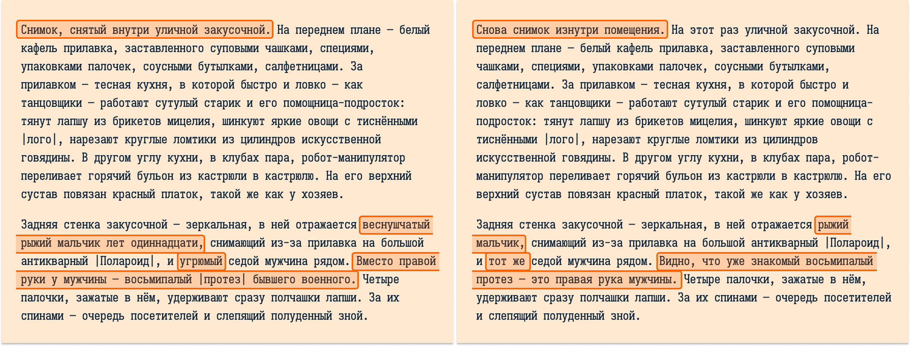

# Десять видов на Лихой город

Небольшой пост-мортем к моему вагону на «Паровозик-9».

## Интерактивная

Текст в ИЛ не должен быть статичным. Раз уж в названии приняли слово «интерактивная» — автор, будь добр, пиши так, чтобы читатель видел реакцию текста на свои действия.

Движки и системы помогают, конечно, как могут, в формировании динамичного текста, отражают текущее состояние мира («Здесь вы видите  дверь, сундук и серебряный ключ»). Но литература штука такая — любая механичность сразу видна и сразу сбивает погружение. Автор, будь добр, позаботься…

И это только про описание одномоментного состояния мира — описание с точки зрения *главного героя* и, может быть, *рассказчика*. А ведь ещё есть сам *читатель*. У нас не визуальное медиа, нам приходится описывать то, что «видит» читатель. И это описание тоже должно быть динамичным и не механичным. Если читатель может «увидеть» объект в двух разных контекстах, описание объекта должно учитывать, сталкивался ли с ним читатель раньше. Автор, будь добр?

«Поход за покупками в Лихой Город» — моя попытка решить такую задачу. Все фотографии представляются читателю в случайном порядке, да и сам читатель может выбрать любую из них. Поэтому описания тех объектов, которые присутствуют в нескольких фотографиях, учитывают, видел ли их читатель до этого. И описания собираются максимально бесшовно.

Если вы не заметили этого, значит, я справился.

## Atrament

Atrament — отличный фреймворк и js-плеер поверх ink для написания браузерной ИЛ, не в пример тому, что предлагают сами inkle. Рекомендую.

Но при этом, мне было сложно решать задачу с динамическими «читательскими» описателями в ink. Хотя, казалось бы, это самый подходящий для ИЛ язык.  Может быть, не нашёл нужный подход, но тот, что придумал — с флагами, отслеживанием «памяти» читателя — был сплошным мучением. Последующее переписывание на Python с Textual было лёгкой прогулкой в сравнении.

## Вдохновение

«Тринадцать видов картонного города» Ульяма Гибсона. Стабильно перечитываю раз в пару лет.

Отсюда и формат фотографий, и рубленые предложения, и стиль, больше *подразумевающий*, чем описывающий. Каждое фото — это мини-диорама с историей, увидеть которую — задача читателя.  
Не откажите себе в удовольствии, прочитайте, там всего пара страниц: [ссылка на RoylaLib.com](https://royallib.com/read/gibson_uilyam/13_foto_kartonnogo_goroda.html#0).

А если понравится, то там же, такая же небольшая и в том же сеттинге [«Комната Скиннера»](https://royallib.com/read/gibson_uilyam/komnata_skinnera.html#0).
